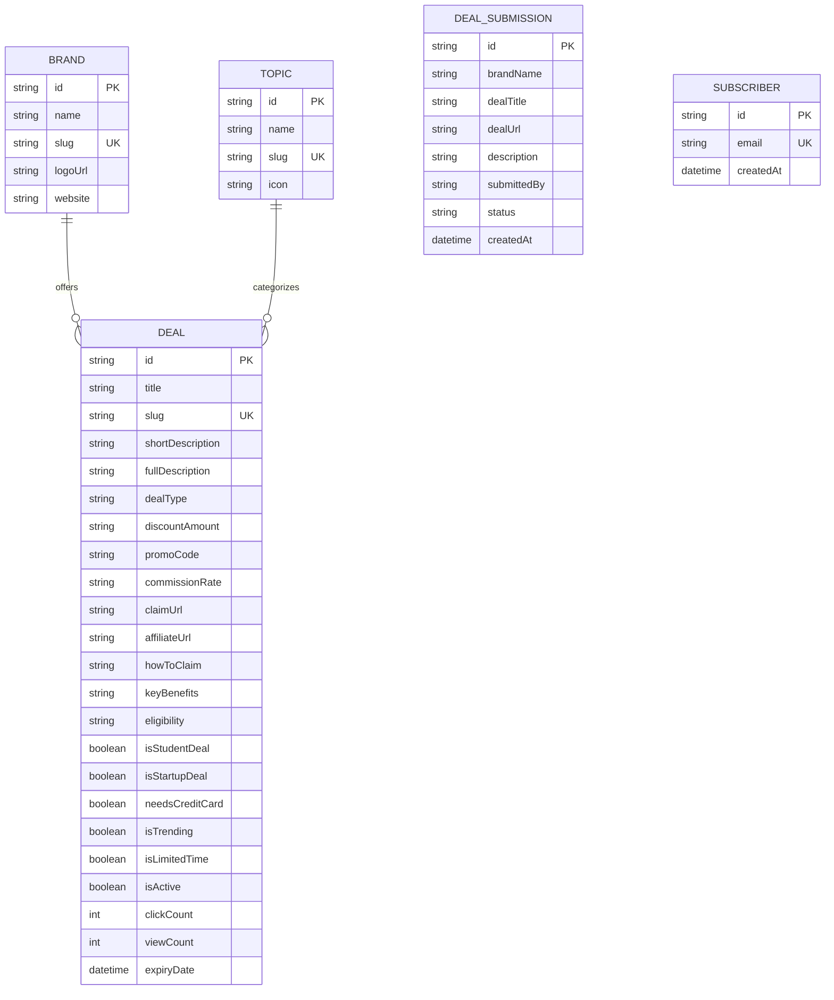

#  Paradox (`paradox.engineer`)

> **Autonomous Developer Perks & Tech Deal Discovery Engine**  
> A production-grade full-stack platform aggregating verified developer credits, cloud infrastructure grants, student packs, and software discounts with automated deal ingestion and dynamic affiliate monetization.

[](https://paradox.engineer)
[](https://nextjs.org/)
[](https://react.dev/)
[](https://www.typescriptlang.org/)
[](https://tailwindcss.com/)
[](https://www.prisma.io/)
[](https://sqlite.org/)

---

## 📌 Executive Summary

**Paradox** ([paradox.engineer](https://paradox.engineer)) solves the fragmentation of developer savings and startup credit programs. Software engineers, students, and early-stage founders regularly lose thousands of dollars in cloud infrastructure credits, API allowances, and developer software licenses because deals are scattered across Discord servers, Reddit threads, and obscure promotion landing pages.

Paradox consolidates **165+ industry-leading tech brands** (OpenAI, Anthropic, DigitalOcean, JetBrains, Supabase, Vultr, AWS, GitHub) into a fast, searchable, and verified directory. The platform features an **autonomous deal crawler**, **dynamic affiliate link rewriting**, a **full-featured moderation control center**, and **SEO-optimized schemas** that earn continuous referral commissions.

---

## 🚀 Key Engineering Highlights

### 1. Hybrid Server & Client Architecture (Next.js 16 App Router)
- **Zero-Layout Shift & Rapid FCP**: Server-side rendered (SSR) catalog pages with streaming and Incremental Static Regeneration (`revalidate = 120`) guarantee lightning-fast page delivery and high Lighthouse scores.
- **Client-Side Interactivity**: Isolates client boundaries (`'use client'`) to stateful UI elements—including instantaneous live search, multi-criteria filtering (Topic, Category, Sorting), and alphabet jump navigation (`All`, `A-Z`, `#`).

### 2. Autonomous Deal Crawler & Ingestion Pipeline
- **Continuous Discovery Engine**: Scrapes and verifies newly announced promotions, sign-up credits, and coupon codes from developer communities and official landing pages.
- **Automated Lifecycle Management**: Automatically flags expired campaigns, verifies destination URLs, and updates catalog records via a secure cron webhook endpoint (`/api/cron/refresh-deals`).

### 3. Programmatic Monetization & Commission Tracking
- **Universal Affiliate Wrapping**: Powered by Skimlinks Publisher Network (`310009X1798390`), dynamically attaching affiliate tracking cookies to outbound partner clicks across 48,500+ merchants without hardcoded tracking parameters.
- **Revenue Intelligence**: Catalog tracking with estimated commission rates (e.g. Cloudways `$50–$125 CPA`, DigitalOcean `$25–$100 Bounty`, Notion `50% 1st Year RevShare`, Coursera `15%–45% per sale`).
- **Global & Indian Payout Compatibility**: Direct integration for Wire/NEFT and PayPal bank transfers with complete W-8BEN treaty compliance (0% US withholding tax).

### 4. Enterprise-Grade SEO & Structured Data
- **Google Rich Results Ready**: Full JSON-LD Schema markup (`AggregateOffer`, `Organization`, `BreadcrumbList`, `WebSite`) embedded on deal and directory pages.
- **Dynamic XML Sitemap & Robots.txt**: Programmatically generated `/sitemap.xml` indexing all 165+ brand profiles, 12 topics, and individual deal deep-links.

### 5. Comprehensive Admin Control Center (`/admin`)
- **Deal Management**: Live CRUD operations, search and filter by status (Active, Paused, Expired), and 1-click active/paused toggling.
- **Community Submissions Queue**: Moderation workflow to review, sanitize, and publish user-submitted perks live to the site.
- **Crawler Dashboard**: Manual trigger for on-demand deal ingestion with real-time sync logs and cron configuration guide.

---

## 🏗️ Architecture & Data Flow

```mermaid
flowchart TD
    User([Visitor / Developer]) -->|Visits paradox.engineer| CDN[Vercel Global Edge Network]
    CDN --> NextApp[Next.js 16 App Router]

    subgraph AppServer [Application Server Layer]
        NextApp --> SSR[Server Components]
        NextApp --> API[API Route Handlers]
        API --> Auth[Admin Control Center]
        API --> Crawler[Autonomous Ingestion Engine]
        API --> CronEndpoint[/api/cron/refresh-deals]
    end

    subgraph DB [Database Layer - Prisma ORM]
        SSR & API --> Prisma[Prisma Client]
        Prisma --> SQLite[(SQLite / PostgreSQL)]
    end

    subgraph External [External Services & Monetization]
        CronJob[cron-job.org Scheduler] -->|Every 6 Hours| CronEndpoint
        User -->|Clicks 'Claim Deal'| Skimlinks[Skimlinks Affiliate Tag]
        Skimlinks -->|Redirects with Cookie| Merchant[Partner Merchant: DigitalOcean / Vultr / Coursera]
        Merchant -->|Commission Paid| Bank[Direct Bank Wire / PayPal Payout]
    end
```

---

## 🗄️ Database Schema (Prisma ORM)



---

## 💻 Tech Stack & Tooling

| Layer | Technologies |
|---|---|
| **Frontend** | [Next.js 16 (App Router)](https://nextjs.org), [React 19](https://react.dev), [Tailwind CSS v4](https://tailwindcss.com), TypeScript 5 |
| **Backend** | Next.js API Routes, Server Actions, Route Handlers |
| **Database & ORM** | [Prisma 5.22](https://www.prisma.io/), SQLite (Development & Production compatible), PostgreSQL ready |
| **Monetization** | [Skimlinks Publisher Platform](https://skimlinks.com) (`Publisher ID: 310009X1798390`) |
| **Automation** | Autonomous Node.js crawler & refresher pipeline, External webhook cron |
| **Deployment & Hosting** | [Vercel](https://vercel.com) Edge Infrastructure, Custom Domain with SSL (`paradox.engineer`) |
| **SEO & Performance** | JSON-LD Structured Data, Dynamic XML Sitemap, Responsive Web Icons |

---

## 📂 Project Directory Structure

```bash
dealfinder/
├── prisma/
│   ├── schema.prisma           # Prisma schema definition
│   ├── dev.db                  # Pre-seeded SQLite database (165 brands, 44 deals)
│   └── seed.ts                 # Database seeder
├── public/
│   ├── favicon.svg             # Modern Paradox geometric branding
│   └── icon.svg                # Web app manifest icon
├── src/
│   ├── app/
│   │   ├── admin/              # Admin Control Center (CRUD, moderation, crawler)
│   │   ├── affiliate-disclosure/ # Dedicated reader transparency disclosure
│   │   ├── api/
│   │   │   ├── admin/          # Admin deal and submission APIs
│   │   │   ├── click/[slug]/   # Outbound click analytics
│   │   │   ├── cron/refresh-deals/ # 6-hour autonomous crawler webhook
│   │   │   ├── submit-deal/    # Community submission intake
│   │   │   └── subscribe/      # Newsletter subscriber intake
│   │   ├── brands/             # 165+ Brand Directory with alphabet jump
│   │   ├── category/[type]/    # Deal category pages (discounts, credits, etc.)
│   │   ├── resources/[slug]/   # Single deal deep-dive with claim flow
│   │   ├── topics/[slug]/      # Filtered topic pages (AI, Cloud, Dev Tools)
│   │   ├── layout.tsx          # Root layout with Skimlinks tag & Navbar/Footer
│   │   ├── page.tsx            # High-conversion Homepage
│   │   ├── robots.ts           # Robots.txt generator
│   │   └── sitemap.ts          # Dynamic XML Sitemap generator
│   ├── components/
│   │   ├── BrandLogo.tsx       # Multi-resolution fallback logo engine
│   │   ├── BrandsDirectoryClient.tsx # Interactive alphabet & topic brand catalog
│   │   ├── DealCard.tsx        # Responsive perk card with live badges
│   │   ├── ExpiryBadge.tsx     # Expiration countdown badge
│   │   ├── Footer.tsx          # Site footer with compliance and quick links
│   │   └── Navbar.tsx          # Header with category dropdown & mobile drawer
│   ├── lib/
│   │   ├── db.ts               # Singleton Prisma client instance
│   │   ├── deal-crawler.ts     # Autonomous web discovery engine
│   │   ├── deal-refresher.ts   # Sync pipeline & expiration updater
│   │   └── types.ts            # Core TypeScript interfaces & definitions
│   └── scripts/
│       ├── seed-156-brands.ts  # Catalog seeding script for 165+ brands
│       └── refresh-deals.ts    # CLI crawler execution runner
├── package.json
└── README.md
```

---

## 🛠️ Local Development Setup

### Prerequisites
- **Node.js**: v18.18 or higher
- **npm** / **pnpm** / **yarn**

### Quick Start
```bash
# 1. Clone the repository
git clone https://github.com/<your-username>/paradox.engineer.git
cd paradox.engineer/dealfinder

# 2. Install dependencies (triggers automatic prisma generate)
npm install

# 3. Synchronize database schema & seed initial brands
npx prisma db push
npx tsx src/scripts/seed-156-brands.ts

# 4. Start local development server
npm run dev
```

Visit [`http://localhost:3000`](http://localhost:3000) in your browser to view the application.

---

## 🌐 Production Deployment Guide

> **Important Architecture Note**: Because Paradox is a full-stack Next.js application utilizing dynamic server-side rendering, background API webhooks, and database queries, it requires a Node.js / Serverless runtime. **Vercel** is the official, free, zero-config deployment platform for Next.js.

### Step 1: Push Code to GitHub
```bash
git add .
git commit -m "feat: complete Paradox developer perks engine with 165+ brands"
git remote add origin https://github.com/<your-username>/paradox.engineer.git
git push -u origin main
```

### Step 2: 1-Click Deploy on Vercel
1. Go to [vercel.com](https://vercel.com) and click **"Add New Project"**.
2. Select your GitHub repository: `paradox.engineer`.
3. *(If `dealfinder` is in a subfolder)*: Set **Root Directory** to `dealfinder`.
4. Click **Deploy**. Vercel will build and assign an instant production URL.

### Step 3: Connect Custom Domain (`paradox.engineer`)
1. In your Vercel Dashboard, go to **Project Settings &rarr; Domains**.
2. Add `paradox.engineer` and `www.paradox.engineer`.
3. In your domain registrar (e.g. Namecheap, GoDaddy, Cloudflare), set the DNS records:
   - **Type `A`**: `@` &rarr; `76.76.21.21`
   - **Type `CNAME`**: `www` &rarr; `cname.vercel-dns.com`
4. Vercel automatically generates free SSL certificates within minutes.

### Step 4: Configure Free 6-Hour Automated Ingestion
1. Create a free account on [cron-job.org](https://cron-job.org).
2. Create a new cron job:
   - **URL**: `https://paradox.engineer/api/cron/refresh-deals`
   - **Schedule**: Every 6 hours (`0 */6 * * *`)
3. Save! Your platform will now discover deals, tag commissions, and archive expired discounts 24/7 autonomously.

---

## 👨‍💻 Author & Engineering Contact

**Pradhuman Singh**  
- **Website**: [paradox.engineer](https://paradox.engineer)  
- **Email**: [pradhumansingh196@gmail.com](mailto:pradhumansingh196@gmail.com)  
- **Specialization**: Full-Stack Web Architecture, Next.js, TypeScript, Distributed Scraping & High-Yield Affiliate Systems

---

## 📄 License
This project is open-source under the [MIT License](LICENSE).
